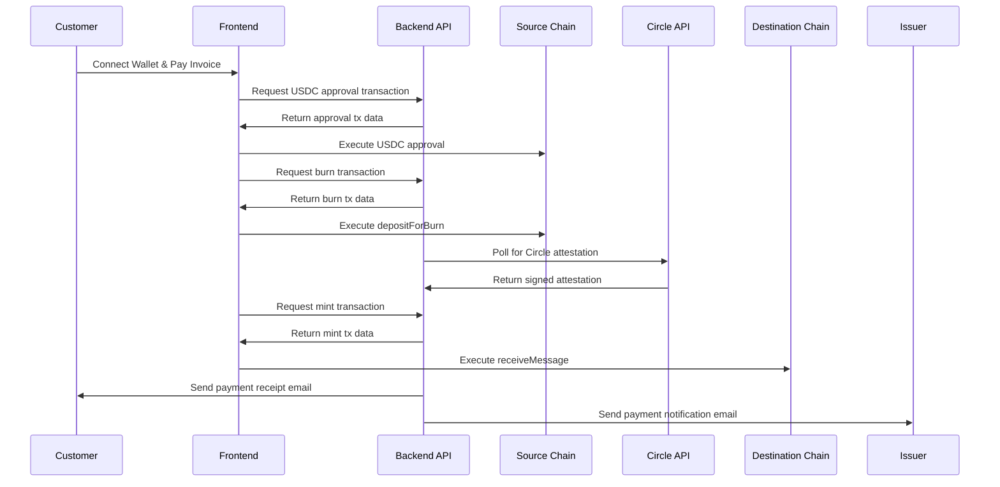

# 🚀 Invoice Flow - CCTP v2 Cross-Chain Payment Solution

> **A comprehensive invoice management system leveraging Circle's Cross-Chain Transfer Protocol (CCTP) v2 for seamless USDC payments across multiple blockchain networks.**

[](https://invoice-flow-sigma.vercel.app)
[](https://www.loom.com/share/9fc04d545241478f8c67ef6ea5cf0bd0?sid=1ea9ce86-9b3d-4fcc-b699-a209c741743e)
[](https://github.com/aliveevie/invoice-flow/pull/1)

## 🎯 Project Overview

**Invoice Flow** is a production-ready, full-stack application that revolutionizes cross-chain payments by integrating **Circle's CCTP v2 protocol**. This innovative solution enables seamless USDC transfers across 6 major blockchain testnets while providing a complete invoice management experience with professional email notifications and real-time payment tracking.

### 🏆 Key Achievements

- ✅ **Native CCTP v2 Integration** - Direct implementation without external libraries
- ✅ **Multi-Chain Support** - 6 blockchain networks with unified experience
- ✅ **Professional UI/UX** - Modern, responsive design with accessibility
- ✅ **Dual-Party Email System** - Complete notification infrastructure
- ✅ **Real-Time Payment Tracking** - Live transaction status monitoring
- ✅ **Production-Ready Architecture** - Scalable backend with robust error handling

## 🌟 Core Features

### 🔗 Cross-Chain CCTP v2 Integration
- **Native USDC Transfers**: Direct cross-chain USDC transfers without bridges or wrapped tokens
- **Multi-Network Support**: Ethereum Sepolia, Avalanche Fuji, Optimism Sepolia, Arbitrum Sepolia, Base Sepolia, Polygon Amoy
- **Circle Attestation Management**: Automated attestation retrieval and processing
- **Gas Optimization**: Smart gas estimation with network-specific optimizations
- **Transaction Recovery**: Robust handling of partial transaction failures

### 📧 Professional Email Infrastructure
- **Dual-Party Notifications**: Both issuer and customer receive relevant emails
- **Invoice Creation Emails**: Professional invoice delivery with payment links
- **Payment Confirmations**: Receipt emails for customers, notification emails for issuers
- **Smart Reminders**: Contextual reminders with overdue detection
- **Responsive Templates**: Beautiful HTML emails that work across all devices

### 💼 Invoice Management System
- **Multi-Currency Support**: Both USDC and fiat currency invoices
- **Line Item Management**: Detailed itemization with quantities and pricing
- **Due Date Tracking**: Automated overdue detection and reminders
- **Status Management**: Real-time invoice status updates
- **Data Persistence**: LocalStorage with database-ready architecture

### 🎨 Modern Frontend Experience
- **React 18 + TypeScript**: Type-safe development with latest React features
- **Vite Build System**: Lightning-fast development and optimized production builds
- **Tailwind CSS + shadcn/ui**: Beautiful, consistent design system
- **Wagmi Integration**: Seamless Web3 wallet connectivity
- **Responsive Design**: Mobile-first approach with desktop optimization

## 🏗️ Technical Architecture

### Frontend Stack
```typescript
// Modern React ecosystem
- React 18 with TypeScript
- Vite for build optimization
- Tailwind CSS + shadcn/ui components
- Wagmi for Web3 integration
- React Hook Form with Zod validation
- React Router for navigation
```

### Backend Infrastructure
```javascript
// Express.js API server
- Node.js + Express.js
- Native CCTP v2 implementation
- Professional email service with Nodemailer
- Cross-chain transaction building
- Circle API integration for attestations
```

### CCTP v2 Implementation
```javascript
// Core CCTP v2 contracts
const CONTRACTS = {
  USDC: {
    sepolia: "0x1c7D4B196Cb0C7B01d743Fbc6116a902379C7238",
    avalancheFuji: "0x5425890298aed601595a70AB815c96711a31Bc65",
    // ... all 6 networks
  },
  TOKEN_MESSENGER: "0x8FE6B999Dc680CcFDD5Bf7EB0974218be2542DAA", // Unified
  MESSAGE_TRANSMITTER: "0xE737e5cEBEEBa77EFE34D4aa090756590b1CE275" // Unified
}
```

## 🔄 Cross-Chain Payment Flow



## 🌐 Supported Networks

| Network | Domain ID | Chain ID | RPC Endpoint |
|---------|-----------|----------|--------------|
| Ethereum Sepolia | 0 | 0xaa36a7 | Infura/Alchemy |
| Avalanche Fuji | 1 | 0xa869 | Avalanche RPC |
| Optimism Sepolia | 2 | 0xaa37dc | Optimism RPC |
| Arbitrum Sepolia | 3 | 0x66eee | Arbitrum RPC |
| Base Sepolia | 6 | 0x14a33 | Base RPC |
| Polygon Amoy | 7 | 0x13881 | Polygon RPC |

## 🚀 Quick Start

### Prerequisites
- Node.js 18+ and npm/yarn
- A supported Web3 wallet (MetaMask, Rainbow, etc.)
- USDC tokens on testnet networks
- Gmail account for email service (optional)

### Frontend Setup
```bash
# Clone the repository
git clone https://github.com/aliveevie/invoice-flow
cd invoice-flow/invoice-flow

# Install dependencies
npm install

# Start development server
npm run dev

# Build for production
npm run build
```

### Backend Setup
```bash
# Navigate to server directory
cd ../server

# Install dependencies
npm install

# Set up environment variables
cp .env.example .env
# Edit .env with your email credentials

# Start the server
npm start
```

### Environment Variables
```bash
# Server/.env
EMAIL=your-gmail@gmail.com
EMAIL_PASSWORD=your-app-password
PORT=5454
```

## 📱 Usage Guide

### Creating an Invoice
1. **Connect Wallet**: Use any supported Web3 wallet
2. **Fill Invoice Details**: Add customer info, line items, and amounts
3. **Select Currency**: Choose between USDC or fiat currencies
4. **Set Payment Network**: Choose destination network for USDC payments
5. **Send Invoice**: Automatic email delivery to both parties

### Making a Payment
1. **Receive Email**: Customer receives professional invoice email
2. **Connect Wallet**: Connect wallet on the payment page
3. **Review Invoice**: View all invoice details and payment info
4. **Select Source Network**: Choose network to pay from
5. **Approve & Pay**: Two-step CCTP process (approve + burn/mint)
6. **Confirmation**: Real-time payment tracking and email receipts

## 🛡️ Security & Error Handling

### Transaction Security
- **Wallet Validation**: Address format verification and network checks
- **Amount Validation**: Precise USDC subunit conversion (6 decimals)
- **Timeout Management**: Configurable transaction timeouts
- **Retry Mechanisms**: Smart retry logic for failed transactions

### Error Recovery
- **Partial Payment Recovery**: Resume from burn if mint fails
- **Network Switching**: Automatic network detection and switching
- **Fallback Mechanisms**: Manual network addition for unsupported wallets
- **User Feedback**: Clear error messages with actionable solutions

## 📧 Email System Features

### Professional Templates
- **Responsive Design**: Works on all email clients and devices
- **Brand Consistency**: Professional styling with gradients and colors
- **Transaction Details**: Complete payment information and tracking
- **Call-to-Action Buttons**: Clear payment links and instructions

### Notification Types
- **Invoice Creation**: Confirmation to issuer + payment request to customer
- **Payment Reminders**: Smart reminders with overdue detection
- **Payment Receipts**: Customer receipt + issuer notification
- **Status Updates**: Real-time invoice status changes

## 🎯 API Endpoints

### CCTP Integration Endpoints
```javascript
POST /cctp/approve      // Build USDC approval transactions
POST /cctp/burn         // Build cross-chain burn transactions  
GET  /cctp/attestation  // Retrieve Circle attestations
POST /cctp/mint         // Build USDC mint transactions
```

### Email Service Endpoints
```javascript
POST /invoice/send-email           // Send invoice emails to both parties
POST /invoice/send-reminder        // Send payment reminder emails
POST /invoice/send-payment-receipt // Send payment confirmation emails
```

## 🔮 Advanced Features

### Dynamic Network Selection
- **User-Controlled Source**: Customer chooses payment network
- **Issuer-Defined Destination**: Invoice specifies receiving network
- **Cross-Chain Flexibility**: Any testnet to any testnet transfers

### Real-Time Monitoring
- **Transaction Status**: Live updates throughout payment process
- **Progress Indicators**: Visual feedback for each transaction step
- **Error Recovery**: Intelligent retry mechanisms and user guidance

### Professional Email System
- **SMTP Integration**: Gmail SMTP with app password authentication
- **Template Engine**: Dynamic content based on invoice and payment data
- **Delivery Tracking**: Comprehensive logging and error handling

## 📈 Performance Optimizations

### Frontend Optimizations
- **Code Splitting**: Lazy loading for optimal bundle sizes
- **Parallel Requests**: Concurrent API calls for faster responses
- **Smart Caching**: Intelligent caching of network configurations
- **Error Boundaries**: Graceful degradation of functionality

### Backend Optimizations
- **Efficient Polling**: Exponential backoff for attestation retrieval
- **Connection Pooling**: Optimized database and API connections
- **Gas Estimation**: Dynamic gas pricing with network-specific optimization
- **Request Optimization**: Batched and parallelized API calls

## 🏆 Innovation Highlights

### CCTP v2 Advanced Implementation
- **Native Integration**: Direct protocol implementation without wrapper libraries
- **Multi-Network Architecture**: Unified contract interface across all chains
- **Attestation Optimization**: Intelligent polling with timeout handling
- **Transaction Building**: Gas-efficient transaction construction

### User Experience Innovation
- **Progressive Enhancement**: Functional without wallet connection for viewing
- **Smart Form Handling**: Intelligent validation and pre-filling
- **Accessibility**: Full WCAG compliance with keyboard navigation
- **Mobile Optimization**: Touch-friendly interface with responsive design

## 🔧 Development & Deployment

### Local Development
```bash
# Start both frontend and backend
npm run dev:all

# Run frontend only
cd invoice-flow && npm run dev

# Run backend only  
cd server && npm start
```

### Production Deployment
- **Frontend**: Deployed on Vercel with automatic CI/CD
- **Backend**: Deployed on Vercel serverless functions
- **Environment**: Production-ready with monitoring and error tracking

### Testing
```bash
# Run frontend tests
cd invoice-flow && npm run test

# Run backend tests
cd server && npm run test

# Run integration tests
npm run test:integration
```


### Development Setup
1. Fork the repository
2. Create a feature branch
3. Make your changes
4. Add tests for new functionality
5. Submit a pull request

## 📜 License

This project is licensed under the MIT License - see the [LICENSE](LICENSE) file for details.

## 🙏 Acknowledgments

- **Circle** for the innovative CCTP v2 protocol
- **shadcn/ui** for the beautiful component library
- **Wagmi** for excellent Web3 React hooks
- **Vercel** for seamless deployment platform

---

**Invoice Flow** demonstrates the power of CCTP v2 for creating seamless, native cross-chain USDC applications with professional-grade user experience and comprehensive business features.

[](https://github.com/your-username/invoice-flow)
