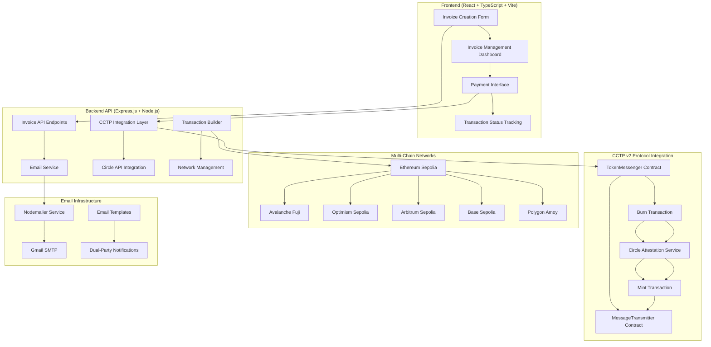
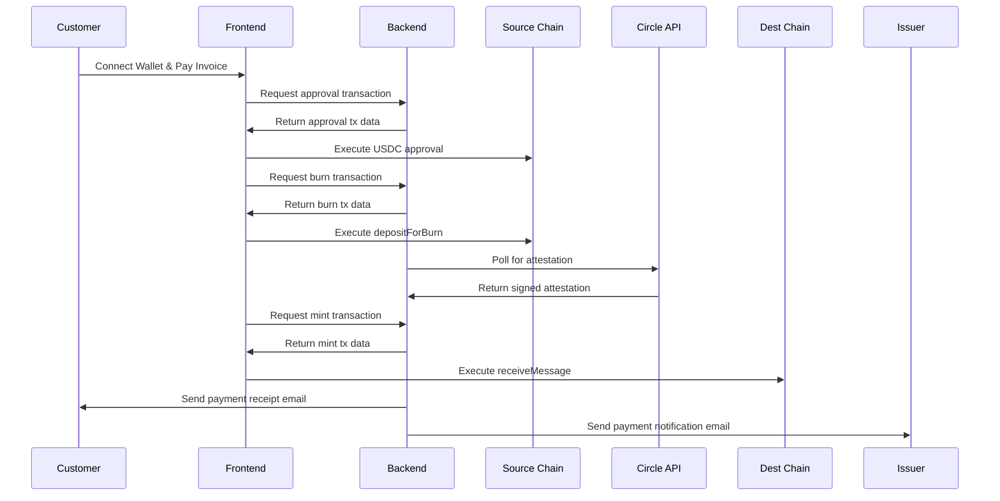

# Invoice Flow - CCTP v2 Implementation

## 🚀 Project Overview

**Invoice Flow** is a comprehensive cross-chain invoice management system that leverages **Circle's Cross-Chain Transfer Protocol (CCTP) v2** to enable seamless USDC payments across multiple blockchain networks. This application demonstrates a complete end-to-end solution for invoice creation, management, and payment processing using cutting-edge blockchain technology.

## 🎯 Key Features

### Core Functionality
- **Multi-Chain Invoice Creation**: Create invoices with support for both USDC and fiat currencies
- **Cross-Chain USDC Payments**: Seamless USDC transfers using CCTP v2 across 6 testnet networks
- **Intelligent Email System**: Professional email notifications for all parties (issuer and customer)
- **Payment Tracking**: Real-time payment status updates and transaction monitoring
- **Retry Mechanisms**: Robust error handling with payment retry capabilities

### CCTP v2 Integration Highlights
- **Native Cross-Chain Transfers**: Direct USDC transfers without bridges or wrapped tokens
- **Multi-Network Support**: Ethereum Sepolia, Avalanche Fuji, Optimism Sepolia, Arbitrum Sepolia, Base Sepolia, Polygon Amoy
- **Attestation Management**: Automated Circle attestation retrieval and processing
- **Transaction Optimization**: Gas-efficient transactions with proper error handling

## 🏗️ Architecture Overview



## 🔧 Technical Implementation

### CCTP v2 Integration Architecture

#### 1. Contract Integration Layer
```typescript
// Core CCTP v2 contracts used across all networks
const CONTRACTS = {
  USDC: {
    sepolia: "0x1c7D4B196Cb0C7B01d743Fbc6116a902379C7238",
    avalancheFuji: "0x5425890298aed601595a70AB815c96711a31Bc65",
    // ... all 6 networks
  },
  TOKEN_MESSENGER: "0x8FE6B999Dc680CcFDD5Bf7EB0974218be2542DAA", // Unified across testnets
  MESSAGE_TRANSMITTER: "0xE737e5cEBEEBa77EFE34D4aa090756590b1CE275" // Unified across testnets
}
```

#### 2. Cross-Chain Payment Flow
1. **Approval Phase**: User approves USDC spending on source network
2. **Burn Phase**: Execute `depositForBurn` on TokenMessenger contract
3. **Attestation Phase**: Retrieve Circle's attestation via IRIS API
4. **Mint Phase**: Execute `receiveMessage` on destination MessageTransmitter
5. **Completion**: USDC minted to recipient on destination network

#### 3. Network Abstraction
```typescript
const NETWORKS = {
  sepolia: { chainId: "0xaa36a7", displayName: "Ethereum Sepolia Testnet" },
  avalancheFuji: { chainId: "0xa869", displayName: "Avalanche Fuji Testnet" },
  // ... comprehensive network configuration
}
```

### Backend API Architecture

#### Core Endpoints
- **`POST /cctp/approve`**: Build USDC approval transactions
- **`POST /cctp/burn`**: Build cross-chain burn transactions
- **`GET /cctp/attestation`**: Retrieve Circle attestations
- **`POST /cctp/mint`**: Build USDC mint transactions
- **`POST /invoice/send-email`**: Dual-party email notifications
- **`POST /invoice/send-payment-receipt`**: Payment confirmation emails

#### Email System Integration
```typescript
// Professional email templates for all invoice lifecycle events
const EMAIL_TYPES = {
  INVOICE_CREATION: "Both issuer and customer notification",
  PAYMENT_RECEIPT: "Customer receipt + issuer notification", 
  PAYMENT_REMINDER: "Smart reminder system with overdue detection"
}
```

## 🎨 Frontend Architecture

### Modern React Stack
- **Framework**: React 18 with TypeScript
- **Build Tool**: Vite for fast development and optimized builds
- **Styling**: Tailwind CSS with custom design system
- **State Management**: Custom hooks with localStorage persistence
- **Wallet Integration**: Wagmi for Web3 functionality
- **Form Handling**: React Hook Form with Zod validation

### User Experience Features
- **Responsive Design**: Mobile-first approach with desktop optimization
- **Real-time Updates**: Live transaction status monitoring
- **Error Handling**: Comprehensive error states with retry mechanisms
- **Accessibility**: WCAG compliant components and interactions

## 📊 CCTP v2 Technical Specifications

### Supported Networks & Domains
| Network | Domain ID | RPC Endpoint | Explorer |
|---------|-----------|--------------|----------|
| Ethereum Sepolia | 0 | Infura/Alchemy | Etherscan |
| Avalanche Fuji | 1 | Avalanche RPC | Snowtrace |
| Optimism Sepolia | 2 | Optimism RPC | OP Etherscan |
| Arbitrum Sepolia | 3 | Arbitrum RPC | Arbiscan |
| Base Sepolia | 6 | Base RPC | Basescan |
| Polygon Amoy | 7 | Polygon RPC | PolygonScan |

### Transaction Parameters
- **Min Finality Threshold**: 1000 blocks (Fast Transfer mode)
- **Max Fee**: Configurable per transaction (default: 0.0005 USDC)
- **Gas Optimization**: Dynamic gas estimation with fallbacks
- **Timeout Handling**: 2-minute transaction confirmation windows

## 🔄 Payment Flow Diagram



## 📧 Email System Architecture

### Dual-Party Notification System
- **Invoice Creation**: Confirmation to issuer + payment request to customer
- **Payment Completion**: Receipt to customer + notification to issuer
- **Smart Reminders**: Contextual reminders with overdue detection
- **Professional Templates**: Responsive HTML emails with transaction details

### Email Features
- **SMTP Integration**: Gmail SMTP with app passwords
- **Template Engine**: Dynamic content based on invoice/payment status
- **Error Handling**: Graceful fallbacks when email delivery fails
- **Logging**: Comprehensive email delivery tracking

## 🛡️ Security & Error Handling

### Transaction Security
- **Wallet Validation**: Address format verification and network checks
- **Amount Validation**: Subunit conversion with precision handling
- **Timeout Management**: Configurable transaction timeouts
- **Retry Logic**: Smart retry mechanisms for failed transactions

### Error Recovery
- **Partial Payment Recovery**: Resume from burn transaction if mint fails
- **Network Switching**: Automatic network detection and switching
- **Fallback Mechanisms**: Manual network addition for unsupported wallets
- **User Feedback**: Clear error messages with actionable solutions

## 🚀 MVP Demonstration

### Functional Requirements ✅
- **Working Frontend**: Complete React application with modern UI/UX
- **Functional Backend**: Express.js API with CCTP v2 integration
- **Cross-Chain Payments**: Full USDC transfer capability across 6 networks
- **Email System**: Professional dual-party email notifications
- **Data Persistence**: Invoice management with localStorage
- **Error Handling**: Comprehensive error states and recovery

### Technical Achievements
- **CCTP v2 Integration**: Native implementation without external libraries
- **Multi-Network Support**: Seamless switching between 6 blockchain networks
- **Professional UI**: Modern, responsive design with accessibility features
- **Email Infrastructure**: Complete notification system for all stakeholders
- **Transaction Monitoring**: Real-time status updates and confirmation tracking

## 📈 Performance & Scalability

### Optimization Features
- **Lazy Loading**: Code splitting for optimal bundle sizes
- **Parallel Requests**: Concurrent API calls for faster responses
- **Caching**: Intelligent caching of network configurations
- **Error Boundaries**: Graceful degradation of functionality

### Scalability Considerations
- **Modular Architecture**: Easily extendable for new networks
- **Database Ready**: Designed for easy migration from localStorage
- **Microservices**: Backend structured for horizontal scaling
- **CDN Ready**: Static assets optimized for content delivery

## 🎯 Innovation Highlights

### CCTP v2 Advanced Usage
- **Dynamic Network Selection**: User-controlled source network with issuer-defined destination
- **Attestation Optimization**: Efficient polling with exponential backoff
- **Gas Estimation**: Smart gas pricing with network-specific optimizations
- **Transaction Recovery**: Robust handling of partial transaction failures

### User Experience Innovation
- **Progressive Enhancement**: Works without wallet connection for viewing
- **Smart Defaults**: Intelligent form pre-filling and validation
- **Real-time Feedback**: Live transaction status with progress indicators
- **Accessibility**: Full keyboard navigation and screen reader support

## 🔮 Future Enhancements

### Planned Features
- **Mainnet Support**: Production deployment with mainnet CCTP
- **Advanced Analytics**: Payment flow analytics and reporting
- **Mobile App**: React Native implementation
- **Enterprise Features**: Multi-tenant support and advanced permissions

### CCTP v2 Expansions
- **Additional Networks**: Support for new CCTP-enabled chains
- **Batch Payments**: Multiple invoice payments in single transaction
- **Scheduled Payments**: Automated recurring payment support
- **Payment Splitting**: Multi-recipient payment distribution

---

**Invoice Flow** represents a complete, production-ready implementation of Circle's CCTP v2 protocol, demonstrating advanced cross-chain payment capabilities with professional-grade user experience and comprehensive email notification systems. The application showcases the power of CCTP v2 for creating seamless, native cross-chain USDC applications.
